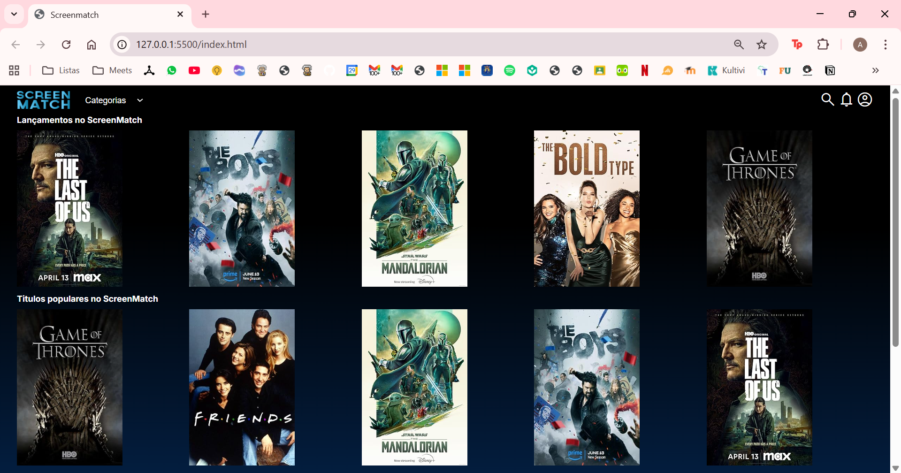
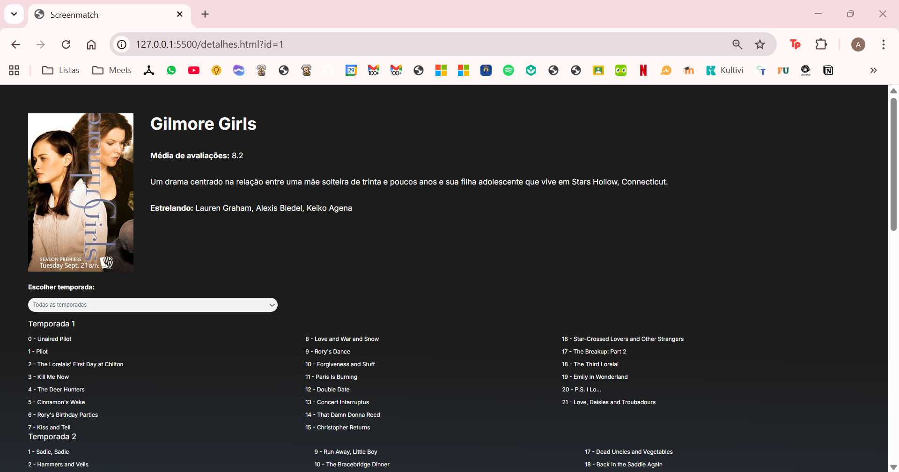
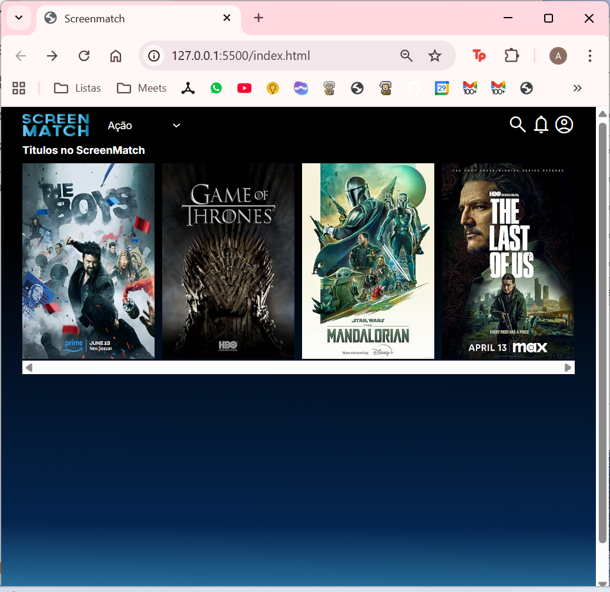

# 🎬 Screenmatch – Catálogo de Séries e Filmes

Projeto desenvolvido durante os cursos de **Spring Boot e Java** da Alura, com foco em **APIs REST, JPA, consumo de APIs externas** e **boas práticas de arquitetura**.

---

## 🖼️ Exemplo de execução

---

## ⚙️ Tecnologias

- Java 17  
- Spring Boot  
- Maven  
- JPA / Hibernate  
- PostgreSQL  
- API OMDb (Open Movie Database)

---

🧠 Conceitos Aprendidos
- Criação de APIs REST com Spring Boot  
- Persistência de dados com Spring Data JPA  
- Requisições HTTP e consumo de APIs externas  
- Manipulação de JSON
- Injeção de dependências e camada de serviços
